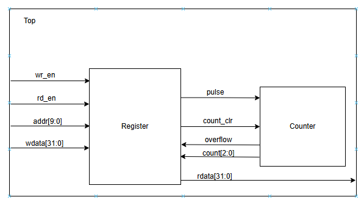

# Pulse Counter Design & Directed Verification

A Verilog-based pulse counter together with a structured SystemVerilog verification environment demonstrating verification planning, directed testing, self-checking verification, and functional validation.

---

## Project Summary

| Attribute | Value |
|-----------|-------|
| **Language** | Verilog, SystemVerilog |
| **Verification Style** | Directed Testing |
| **Simulator** | QuestaSim |
| **Verification Method** | Self-checking Testbench |
| **Coverage** | 100% Code Coverage |

---

## Project Overview

This project implements a 32-bit pulse counter together with a directed SystemVerilog verification environment.

Unlike the UVM-based projects in this portfolio, this project focuses on building a structured directed verification flow, beginning with a formal verification plan before developing the verification environment.

The design includes configurable control and status registers, pulse counting logic, overflow detection, reserved-bit handling, and write-one-to-clear functionality. A self-checking testbench automatically verifies DUT behavior against expected results, minimizing manual waveform inspection.

---

## Features

### Design

- 32-bit pulse counter
- Control Register (CR)
- Status Register (SR)
- Pulse generation
- Overflow detection
- Write-One-to-Clear (W1C) overflow flag
- Reserved-bit protection
- Reserved address handling

### Verification

- Directed verification methodology
- Verification plan
- Self-checking testbench
- Automatic PASS/FAIL reporting
- Functional corner-case testing
- 100% code coverage

---

## Repository Structure

```text
pulse-counter/
│
├── docs/
│   ├── verification_plan.md
│   └── images/
│       ├── rtl_architecture.png
│       ├── waveform.png
│       └── coverage.png
│
├── rtl/
│   ├── counter.v
│   ├── pulse_counter.v
│   └── register.v
│
├── tb/
│   └── test_bench.sv
│
├── sim/
│   ├── Makefile
│   ├── compile.f
│   ├── rtl.f
│   └── tb.f
│
└── README.md
```

---

## RTL Architecture

<p align="center">
    
</p>

<p align="center">
<b>Figure 1.</b> Pulse Counter RTL Architecture.
</p>

---

## Verification Plan

Verification activities were planned before implementation to define functional requirements, expected DUT behavior, corner cases, and pass criteria.

The verification plan covers:

- Register reset verification
- Register read/write functionality
- Reserved-bit verification
- Reserved address handling
- Pulse counting accuracy
- Counter overflow detection
- Overflow flag hold behavior
- Write-One-to-Clear (W1C) verification

A complete verification matrix is available in:

```
docs/verification_plan.md
```

---

## Verification Strategy

A self-checking SystemVerilog testbench was developed using directed test cases derived from the verification plan.

The verification environment automatically applies stimulus, compares DUT responses against expected behavior, and reports PASS/FAIL results without requiring manual result checking.

The verification strategy includes:

- Register access verification
- Directed functional testing
- Boundary-condition testing
- Corner-case verification
- Automatic functional checking

Waveform analysis was used during debugging to investigate RTL behavior and verify signal timing.

---

## Example Simulation

<p align="center">
    
</p>

<p align="center">
<b>Figure 2.</b> Example simulation transaction.
</p>

---

## Verification Results

The directed verification environment successfully verified:

- ✔ Register reset behavior
- ✔ Register read/write operations
- ✔ Reserved-bit protection
- ✔ Reserved address handling
- ✔ Pulse counting functionality
- ✔ Counter overflow detection
- ✔ Overflow flag persistence
- ✔ Write-One-to-Clear functionality

The project achieved **100% code coverage** across all planned verification scenarios.

---

## Lessons Learned

Through this project I gained practical experience with:

- Developing a structured verification plan before implementation
- Designing directed verification test cases
- Building a self-checking SystemVerilog testbench
- Functional validation of RTL designs
- Waveform debugging using QuestaSim
- Systematic verification of register-based digital designs

This project established the verification fundamentals that were later extended into reusable UVM-based verification environments for more complex protocol-based designs.

---

## Future Improvements

Planned enhancements include:

- Migrate to a layered UVM verification environment
- Replace directed testing with constrained-random verification
- Add functional coverage collection
- Implement SystemVerilog Assertions (SVA)
- Develop a scoreboard-based reference model
- Automate regression testing using Makefiles, Bash scripting, and Python utilities
- Integrate continuous regression testing

---

## Tools

- Verilog
- SystemVerilog
- QuestaSim
- Vivado
- Git & GitHub